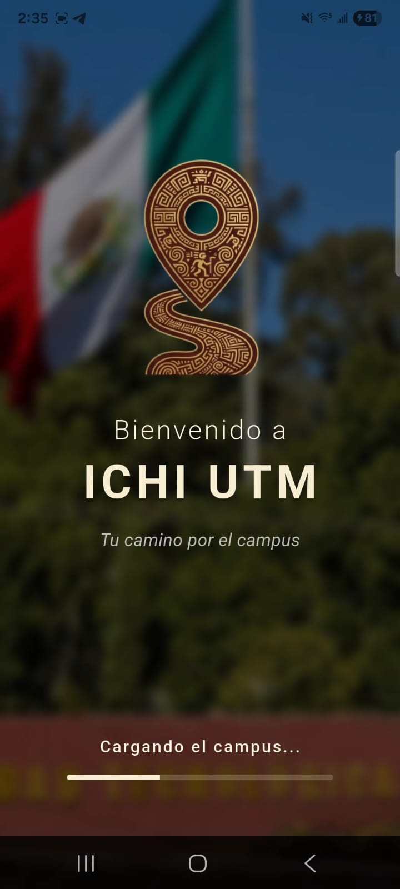
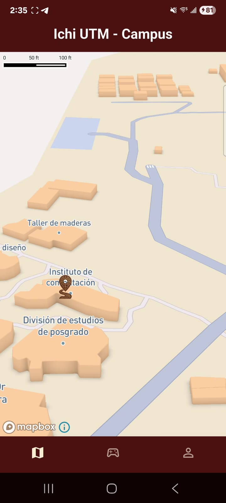
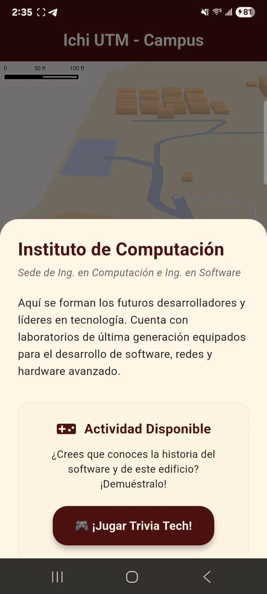

<h1 align="center"> 📍 Ichi UTM - Guía Interactiva del Campus </h1>

  
  
  
  

---

## 📖 Descripción General
**Ichi UTM** (del mixteco *Ichi*, que significa "camino" o "ruta") es una aplicación móvil desarrollada en Flutter, diseñada para facilitar la navegación y orientación de los estudiantes de nuevo ingreso en la **Universidad Tecnológica de la Mixteca (UTM)**. 

La aplicación integra un mapa satelital interactivo del campus con elementos tridimensionales, marcando los Puntos de Interés fundamentales para la vida universitaria. Además, incorpora mecánicas de ludificación (minijuegos contextualizados) vinculados a edificios específicos para reforzar el aprendizaje del entorno de una manera interactiva y amigable.

---

## 🦉 Identidad, Mascota y Accesibilidad Visual
Para guiar a los usuarios a través del campus, la aplicación cuenta con un asistente virtual y mascota oficial: **El Tapacaminos** (también conocido como Chotacabras o *Pu'ujuy*).

* **Justificación Cultural y Temática:** El nombre de la app, *Ichi*, significa camino en mixteco. El Tapacaminos es un ave endémica y muy representativa de la región de la Mixteca oaxaqueña, famosa precisamente por su costumbre de posarse y descansar sobre los caminos de tierra. Esto la convierte en el símbolo perfecto de un "guía" o soporte técnico para los estudiantes que recorren los senderos de la universidad.
* **Accesibilidad e Inclusión (Text-to-Speech):** Pensando en el diseño universal y en personas con discapacidad visual o dificultades de lectura, el asistente Tapacaminos cuenta con una función de voz inteligente que lee en voz alta las descripciones de los edificios. 
* **Soporte Multilingüe:** La universidad es un espacio diverso. Por ello, el asistente está programado para dar soporte de lectura en **Español, Inglés** (apoyando la labor del Centro de Idiomas) y próximamente en **Mixteco**, honrando y dándole utilidad práctica a esta valiosa lengua originaria hablada por muchos alumnos de la UTM.

---

## ⚙️ Tecnologías a Utilizar (Propuestas)
* **Framework principal:** Flutter (Dart).
* **Mapas y Navegación:** `mapbox_maps_flutter` (Renderizado de mapa base satelital con extrusión 3D de edificios).
* **Accesibilidad de Voz:** `flutter_tts` (Motor de Text-to-Speech nativo para la lectura en múltiples idiomas).
* **Seguridad de Credenciales:** `flutter_dotenv` (Protección de Access Tokens mediante variables de entorno).
* **Arquitectura de Software:** Separación de responsabilidades mediante la extracción de datos (`lugares_utm.dart`) y componentes reutilizables (Loaders y Botones animados) para un código escalable.

---

## 👥 Integrantes del Equipo
1. **Ariadna Betsabe Espina Ramirez**
2. **Jose Alberto Pérez Cortes**
3. **Amaury Yamil Morales Diaz**

---

## 📱 Bocetos y Pantallas Propuestas

A continuación se presentan los prototipos base diseñados para la interfaz, siguiendo la paleta institucional (Guinda y Crema) y la integración de mapas 3D. 

  
  
  

1. **Pantalla de Inicio (Splash Screen):** Muestra la identidad visual de la aplicación con el logotipo de **Ichi UTM** y una barra de carga dinámica para transicionar suavemente al mapa.
2. **Pantalla Principal (Mapa Interactivo):** Despliega el mapa de la UTM con marcadores personalizados. Incluye al asistente Tapacaminos flotante para opciones de accesibilidad global.
3. **Pantalla de Detalle del Lugar (POI):** Panel inferior (*Bottom Sheet*) dinámico que presenta información del edificio, la opción de lectura en voz alta (TTS) y el acceso directo a los minijuegos.

---

## 📍 Puntos de Interés Contemplados
La aplicación incluye marcadores interactivos para 11 puntos clave del campus:

| Icono | Punto de Interés | Descripción Breve |
| :---: | :--- | :--- |
| 🏛️ | **Servicios Escolares** | Trámites académicos, becas e inscripciones. |
| 🍴 | **Cafetería Grande** | Área principal de comedor y convivencia estudiantil. |
| 💻 | **Inst. de Computación** | Ing. en Computación, Ing. en Software. IA. |
| 🗣️ | **Centro de Idiomas** | Cursos de Inglés, Chino, Alemán y certificaciones. |
| 📚 | **Biblioteca Universitaria** | Acervo bibliográfico y salas de estudio. |
| 🛠️ | **Inst. de Electrónica y Mecatrónica** | Laboratorios de robótica, circuitos y potencia. |
| 🎨 | **Inst. de Diseño** | Talleres de diseño gráfico e industrial. |
| 🧪 | **Inst. de Alimentos y Química** | Plantas piloto y laboratorios de análisis químico. |
| 📐 | **Inst. de Física y Matemáticas** | Investigación y Astronomía. |
| 🚗 | **Inst. de Ing. Industrial y Automotriz** | Talleres de manufactura y diseño automotriz. |
| ⚖️ | **Inst. de Cs. Sociales y Humanidades** | Áreas académicas de apoyo y formación integral. |

---

## 🎮 Propuestas de Actividades y Juegos por Integrante

### 1️⃣ `/propuesta/trivia-jose/` (Contexto: Instituto de Computación)
* **Responsable:** Jose Alberto Pérez Cortes
* **Idea del juego:** "Trivia Tech UTM". Juego de preguntas y respuestas de opción múltiple para evaluar datos curiosos sobre la historia del software, hardware y la UTM. 
* **Pantallas:** Inicio para seleccionar la categoría y pantalla dinámica de preguntas. *(Nota: Las preguntas han sido estructuradas utilizando Inteligencia Artificial para enriquecer la base de datos).*

### 2️⃣ `/propuesta/cafeteria-ariadna/` (Contexto: Cafetería Grande)
* **Responsable:** Ariadna Betsabe Espina Ramirez
* **Idea del juego:** Simulación y gestión de tiempo. El jugador asume el rol en la preparación de alimentos en un ambiente con alta demanda estudiantil.
* **Pantallas:** Inicio, Vestidor de personaje ("el chino"), Pantalla Principal de Juego (barra, clientes, meta de $1,000) y Pantalla de Fin de Turno.

### 3️⃣ `/propuesta/laberinto-amaury/` (Contexto: Servicios Escolares)
* **Responsable:** Amaury Yamil Morales Diaz
* **Idea del juego:** "Carrera de Trámites". Laberinto top-down donde un avatar estudiantil debe encontrar el camino hacia la ventanilla correcta antes de que se agote el tiempo.
* **Pantallas:** "Ready/Go" con reglas y *Canvas* interactivo del laberinto.