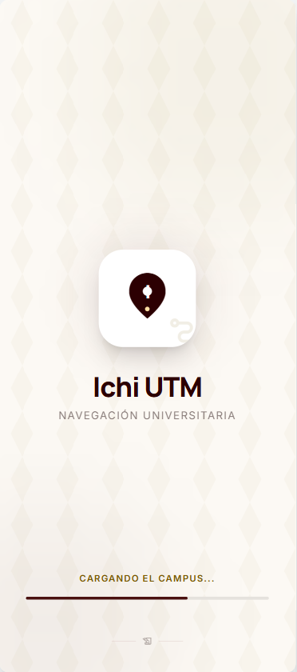
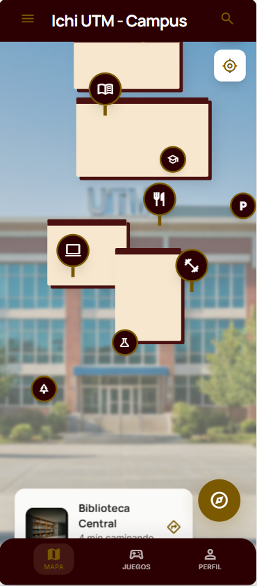
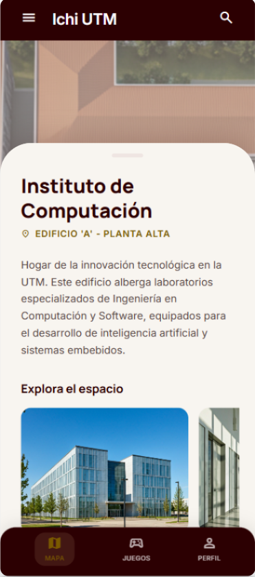

<h1 align="center"> 📍 Ichi UTM - Guía Interactiva del Campus </h1>

  
  
  
  

---

## Descripción General
**Ichi UTM** (del mixteco *Ichi*, que significa "camino" o "ruta") es una aplicación móvil desarrollada en Flutter, diseñada para facilitar la navegación y orientación de los estudiantes de nuevo ingreso en la **Universidad Tecnológica de la Mixteca (UTM)**. 

La aplicación integra un mapa satelital interactivo del campus con elementos tridimensionales, marcando al menos diez Puntos de Interés fundamentales para la vida universitaria. Además, incorpora mecánicas de ludificación (minijuegos contextualizados) vinculados a edificios específicos para reforzar el aprendizaje del entorno de una manera interactiva y amigable.

---

## Tecnologías a Utilizar (Propuestas)
* **Framework principal:** Flutter (Dart).
* **Mapas y Navegación:** `mapbox_maps_flutter` (Para renderizar el mapa base satelital interactivo con relieve y extrusión 3D de edificios, usando un estilo personalizado).
* **Seguridad de Credenciales:** `flutter_dotenv` (Para proteger los Access Tokens de las APIs mediante variables de entorno).
* **Geolocalización:** `geolocator` (Para ubicar al usuario dentro del campus en tiempo real).
* **UI/UX:** `carousel_slider` (Para las galerías de imágenes de cada punto de interés).

---

## Integrantes del Equipo
1. **Ariadna Betsabe Espina Ramirez** 
2. **Jose Alberto Pérez Cortes** 
3. **Amaury Yamil Morales Diaz** 

---

## Bocetos y Pantallas Propuestas

A continuación se presentan los prototipos base diseñados para la interfaz de **Ichi UTM**, siguiendo la paleta institucional (Guinda y Crema) y la integración de mapas 3D. 

  
  
  

1. **Pantalla de Inicio (Splash Screen):**
   Muestra la identidad visual de la aplicación con el logotipo de **Ichi UTM**. Diseñada con un fondo crema limpio para una transición suave hacia el mapa.

2. **Pantalla Principal (Mapa Interactivo):**
   Despliega el mapa de la UTM con extrusión de edificios en 3D. Incluye la barra superior institucional y marcadores personalizados (pines) para los institutos y servicios principales.

3. **Pantalla de Detalle del Lugar (POI):**
   Panel inferior (*Bottom Sheet*) que se activa al tocar un pin. Presenta el nombre del edificio, descripción técnica, galería de imágenes deslizable y el acceso directo a los minijuegos de ludificación.

---

## 📍 Puntos de Interés Contemplados
La aplicación incluye marcadores interactivos para los 11 puntos clave del campus, permitiendo a los alumnos identificar cada edificio y los servicios que ofrece:

| Icono | Punto de Interés | Descripción Breve |
| :---: | :--- | :--- |
| 🏛️ | **Servicios Escolares** | Trámites académicos, becas e inscripciones. |
| 🍴 | **Cafetería Grande** | Área principal de comedor y convivencia estudiantil. |
| 💻 | **Inst. de Computación** | Ing. en Computación, Ing. en Software. IA|
| 🗣️ | **Centro de Idiomas** | Cursos de Inglés Chino, Aleman y certificaciones. |
| 📚 | **Biblioteca Universitaria** | salas de estudio. |
| 🛠️ | **Inst. de Electrónica y Mecatrónica** | Laboratorios de robótica, circuitos y potencia. |
| 🎨 | **Inst. de Diseño** | Talleres de diseño gráfico e industrial. |
| 🧪 | **Inst. de Alimentos y Química** | Plantas piloto y laboratorios de análisis químico. |
| 📐 | **Inst. de Física y Matemáticas** | Investigación y Astronomia. |
| 🚗 | **Inst. de Ing. Industrial y Automotriz** | Talleres de manufactura y diseño automotriz. |
| ⚖️ | **Inst. de Cs. Sociales y Humanidades** | Áreas académicas de apoyo y formación integral. |

---

## Propuestas de Actividades y Juegos por Integrante

A continuación se describe la estructura de carpetas sugerida y la temática de cada juego (uno por integrante) contextualizado dentro de la UTM:

### 1️⃣ `/propuesta/trivia-jose/` (Contexto: Instituto de Computación)
* **Responsable:** Jose Alberto Pérez Cortes
* **Idea del juego:** "Trivia Tech UTM". Es un juego de preguntas y respuestas de opción múltiple diseñado para evaluar y enseñar datos curiosos sobre la historia de la computación, lenguajes de programación y detalles específicos de la universidad. 
* **Pantallas:** Contará con una pantalla de inicio para seleccionar la categoría y una segunda pantalla dinámica donde se despliegan las preguntas. *(Nota: Las preguntas han sido estructuradas utilizando Inteligencia Artificial para enriquecer la base de datos, adaptándolas al contexto).*

### 2️⃣ `/propuesta/cageteria-ariadna/` (Contexto: Cafeteria grande)
* **Responsable:** Ariadna Betsabe Espina Ramirez
* **Idea del juego:** Un juego de simulación y gestión de tiempo ambientado en la icónica "Cafetería Grande", el punto de encuentro por excelencia de los universitarios para comer, convivir y, sobre todo, disfrutar de sus famosos tacos. El juego busca capturar la vibrante atmósfera del lugar.
* **Pantalla Principal:** Con opción de "Iniciar Juego".
* **Pantalla de Vestidor:** Para seleccionar el outfit del cocinero "el chino".
* **Pantalla Principal de Juego:** Vista de la barra, estación de preparación de tacos, fila de clientes estudiantes, marcador de dinero acumulado y meta ($1,000). Se ven las pantallas informativas de la universidad al fondo.
* **Pantalla de Fin de Turno:** Aparece al llegar a los 1,000 pesos, mostrando el éxito del día.

### 3️⃣ `/propuesta/laberinto-amaury/` (Contexto: Servicios Escolares)
* **Responsable:** Amaury Yamil Morales Diaz
* **Idea del juego:** "Carrera de Trámites". Un laberinto interactivo visto desde arriba donde el jugador controla un avatar estudiantil. El objetivo es encontrar el camino a través de los pasillos para llegar a la ventanilla de "Becas" o "Inscripciones" antes de que se agote el tiempo, simulando el proceso de hacer trámites.
* **Pantallas:** Pantalla de "Ready/Go" con las reglas, y la pantalla del *canvas* interactivo donde se desarrolla el laberinto.
